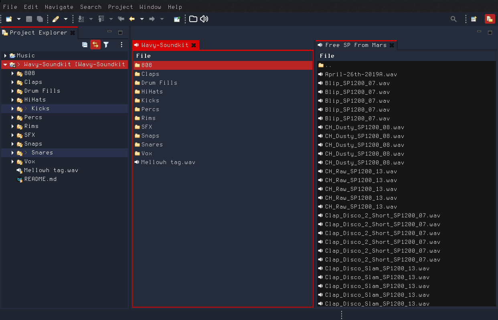

# Sample Commander

Sample Commander is an application designed to assist in organizing audio files, also known as [samples](https://en.wikipedia.org/wiki/Sampling_(music)). 

It is written as an Eclipse plugin but is available as a standalone e4 RCP application.

### Motivation

Sample Commander aims to offer the convenient sample browsing experience provided in modern [DAW](https://en.wikipedia.org/wiki/Digital_audio_workstation)'s with an [orthodox file manager](https://en.wikipedia.org/wiki/File_manager#Orthodox_file_managers) interface.

It takes inspiration from software such as:

- **FL Studio:** provides a [file browser](https://www.image-line.com/support/flstudio_online_manual/html/browser.htm), a single file tree to view a users sample library. It is convenient for finding sounds to use in a song, but limited in its ability to quickly reorganize the sample libraries structure.

- **Krusader:** A Qt based orthodox file manager. Provides excellent file mangement capabilities and workflow. 

## Features:
- Navigate file directory's quickly with your keyboard

- View multiple directory contents side-by-side

- Supports common file operations (cut, copy, delete, etc.) between directories. 

- Audio playback for .wav, .mp3 and .flac is supported and can be started by selecting a supported file.  

- Git integration to keep track of changes to your audio library

## Screenshots:

## 📥 Installation

### Update Site

`https://raw.githubusercontent.com/AObuchow/Sample-Commander/updatesite/updatesite/`

## Libraries used:

- [java-stream-player](https://github.com/goxr3plus/java-stream-player) is used for audio playback

- [push-p2-repo-action](https://github.com/ingomohr/push-p2-repo-action) provides a GitHub CI Action used to build and release the project

- [egit](https://github.com/eclipse/egit) provides git integration

- [Eclipse Spectrum Theme](https://github.com/AObuchow/Eclipse-Spectrum-Theme) is used to style the application
